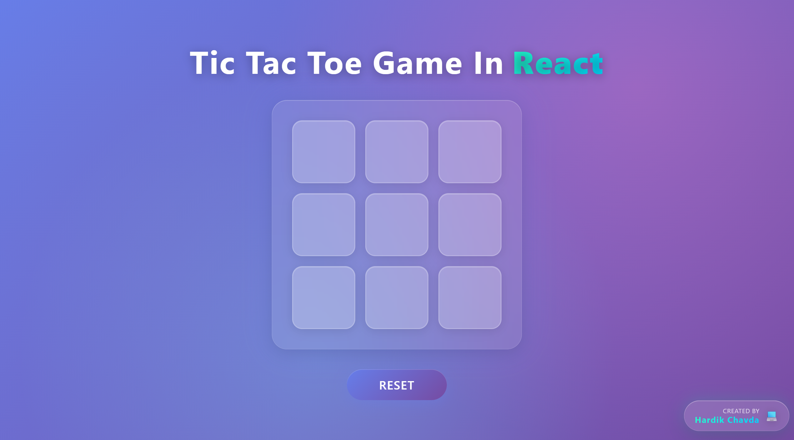
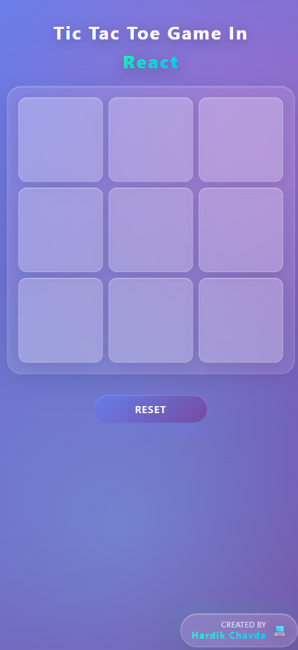

# 🎮 Beautiful Tic-Tac-Toe Game

A modern, responsive Tic-Tac-Toe game built with React and Vite, featuring beautiful glassmorphism design and smooth animations.

  

## ✨ Features

- 🎨 **Beautiful UI**: Modern glassmorphism design with gradient backgrounds
- 📱 **Fully Responsive**: Works perfectly on all devices (desktop, tablet, mobile)
- ⚡ **Smooth Animations**: Engaging hover effects and transitions
- 🎯 **Interactive Gameplay**: Click to place X's and O's with visual feedback
- 🏆 **Win Detection**: Automatic win detection with celebration message
- 🔄 **Reset Functionality**: Easy game reset button
- ♿ **Accessible**: Keyboard navigation and screen reader friendly

## 🚀 Live Demo

Visit the live demo: [Tic-Tac-Toe Game](https://your-vercel-deployment-url.vercel.app)

## Screenshot



## 🛠️ Technologies Used

- **React** - Frontend framework
- **Vite** - Build tool and development server
- **CSS3** - Modern styling with animations
- **JavaScript ES6+** - Game logic
- **Vercel** - Deployment platform

## 📦 Installation & Setup

1. **Clone the repository**
   ```bash
   git clone https://github.com/your-username/tic-tac-toe.git
   cd tic-tac-toe
   ```

2. **Install dependencies**
   ```bash
   npm install
   ```

3. **Start development server**
   ```bash
   npm run dev
   ```

4. **Build for production**
   ```bash
   npm run build
   ```

5. **Preview production build**
   ```bash
   npm run preview
   ```


## 🤝 Contributing

1. Fork the repository
2. Create your feature branch (`git checkout -b feature/AmazingFeature`)
3. Commit your changes (`git commit -m 'Add some AmazingFeature'`)
4. Push to the branch (`git push origin feature/AmazingFeature`)
5. Open a Pull Request


## 👨‍💻 Author

**Your Name**
- GitHub: [@your-username](https://github.com/codewith-hardik)
- LinkedIn: [Your LinkedIn](https://linkedin.com/in/chavdahardik)

## 🙏 Acknowledgments

- React team for the amazing framework
- Vite team for the blazing fast build tool
- Vercel for the excellent hosting platform

---